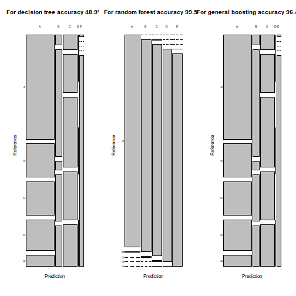

# Practical machine language assignment

maruf10155

## Background

Using devices such as Jawbone Up, Nike FuelBand, and Fitbit it is now possible to collect a large amount of data about personal activity relatively inexpensively. These type of devices are part of the quantified self movement – a group of enthusiasts who take measurements about themselves regularly to improve their health, to find patterns in their behavior, or because they are tech geeks. One thing that people regularly do is quantify how much of a particular activity they do, but they rarely quantify how well they do it. In this project, your goal will be to use data from accelerometers on the belt, forearm, arm, and dumbell of 6 participants. They were asked to perform barbell lifts correctly and incorrectly in 5 different ways. More information is available from the website: <http://web.archive.org/web/20161224072740/http:/groupware.les.inf.puc-rio.br/har>

In this project, we predict "classe"
variable in test dataset using the training dataset.

## Loading datasets and packages


```r
library(caret)
library(ggplot2)
train = read.csv("pml-training.csv")
test = read.csv("pml-testing.csv")
dim(train)
```

```
## [1] 19622   160
```

```r
dim(test)
```

```
## [1]  20 160
```

## Processing datasets

At first, we delete columns are containing NA or having zero variance from both train and test datasets. 


```r
colNA = colSums(is.na(train)) == 0
train1 = train[,colNA]
test1 = test[,colNA]
zerovar = nearZeroVar(train1)
train2 = train1[,-zerovar]
test2 = test1[,-zerovar]
```

Now, we remove unnecessary variables from processes train and test datasets.


```r
trainf = train2[,-(1:6)]
testf = test2[,-(1:6)]
dim(trainf)
```

```
## [1] 19622    53
```

```r
dim(testf)
```

```
## [1] 20 53
```

So, our final datasets has 53 variables.

Analysis

For further analysis, let us split dataset "trainf" into train and test datasets. We are using "caret" package for machine learnig analysis.


```r
set.seed(1234)
intrain = createDataPartition(trainf$classe,p=.7,list = FALSE)
training = trainf[intrain,]
testing = trainf[-intrain,]
```

The following plot will show correlation between variables.


```r
cormat = cor(training[,-53])
row.names(cormat) = NULL
colnames(cormat) = NULL
levelplot(cormat)
```


At first we fit amodel using decision trees. 


```r
fit1 = train(classe~.,method = "rpart", data = training)
library(rattle)
fancyRpartPlot(fit1$finalModel)
```


prediction on test dataset


```r
pred1 = predict(fit1,testing)
cm1 = confusionMatrix(pred1,testing$classe)
cm1$overall[1]
```

```
##  Accuracy 
## 0.4890399
```

For this model accuracy is 48.9%. Now, we apply random forest method


```r
library(randomForest)
fit2 = randomForest(classe~., data = training)
pred2 = predict(fit2,testing)
cm2 = confusionMatrix(pred2,testing$classe)
cm2$overall[1]
```

```
##  Accuracy 
## 0.9964316
```

Accuracy for random forest is 99.5%. Now  are using generalized boosted model. 


```r
control <- trainControl(method='cv', number = 3)
fit3 = train(classe~., data = training, method = "gbm", verbose = FALSE,trControl = control)
pred3 = predict(fit3,testing)
cm3 = confusionMatrix(pred3,testing$classe)
cm3$overall[1]
```

```
##  Accuracy 
## 0.9636364
```

Accuracy for random forest is 96.46%. Now we plot a graph showing accuracucy of prediction.


```r
par(mfrow=c(1,3))
plot(cm1$table,main="For decision tree accuracy 48.9%")
plot(cm2$table,main="For random forest accuracy 99.5%")
plot(cm1$table,main="For general boosting accuracy 96.46%")
```



So, random forest model gives more accurate prediction. Now, we will predict for given test datasets.


```r
pred4 = predict(fit2,testf)
pred4
```

```
##  1  2  3  4  5  6  7  8  9 10 11 12 13 14 15 16 17 18 19 20 
##  B  A  B  A  A  E  D  B  A  A  B  C  B  A  E  E  A  B  B  B 
## Levels: A B C D E
```

## Conclusion

Random forest model gives more accurate prediction than decision tree and boosting for the given datasets. Random forest model gives 100% accurate prediction (tested in quiz).
